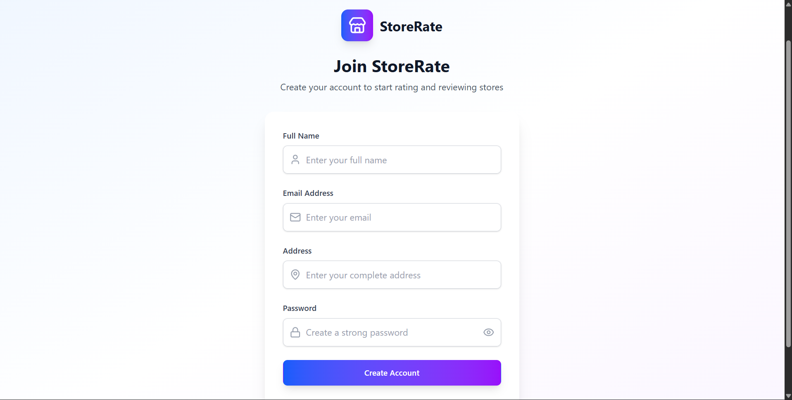
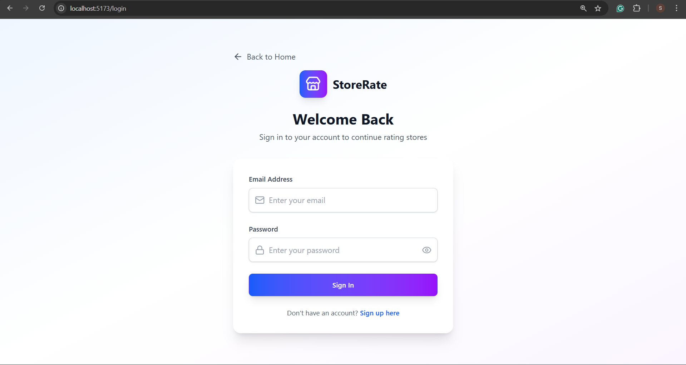
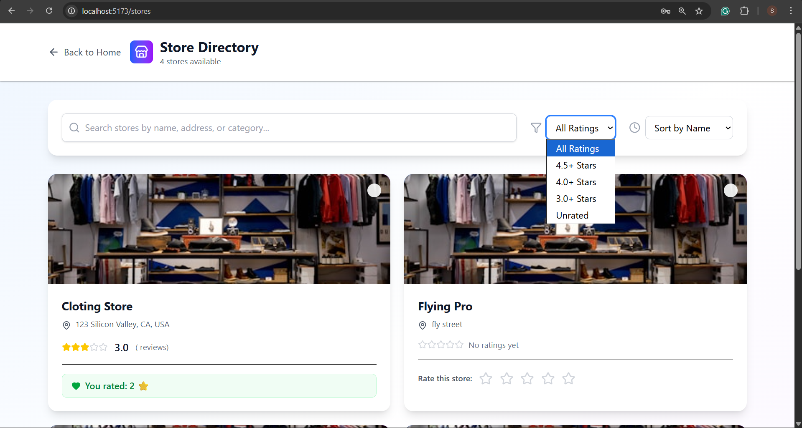
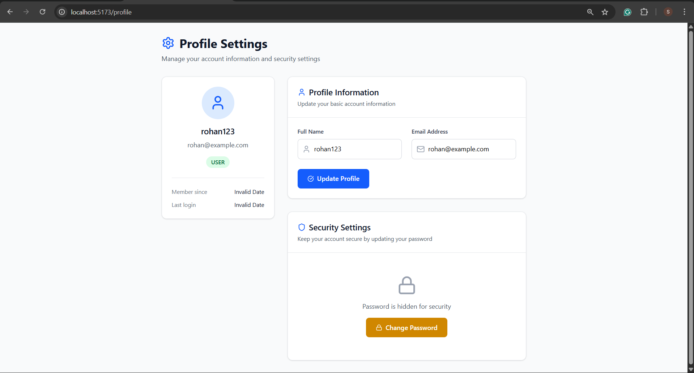
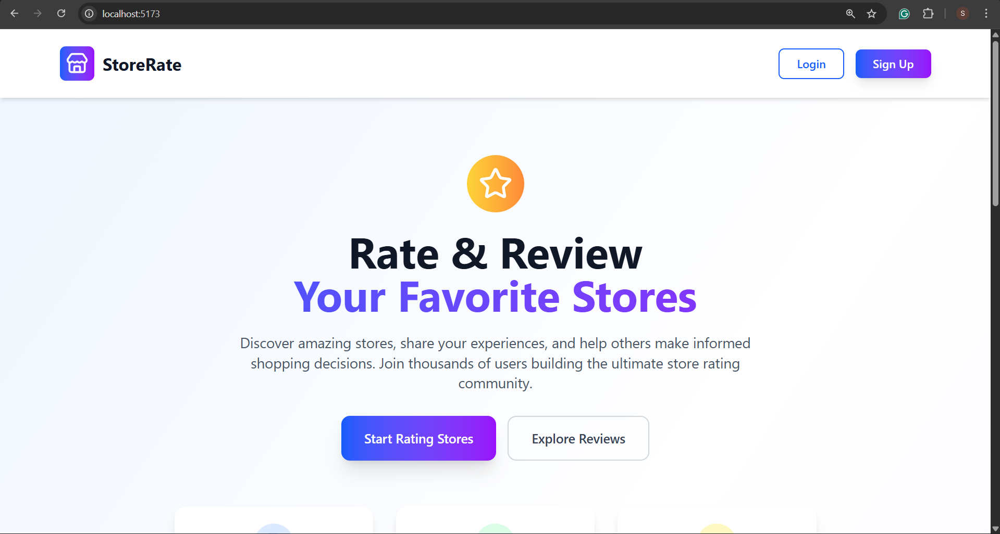
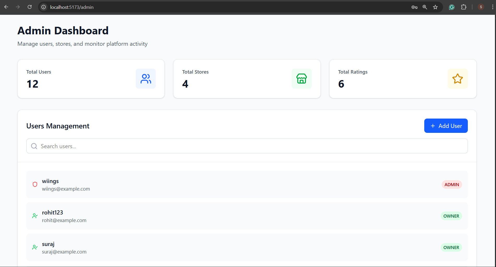
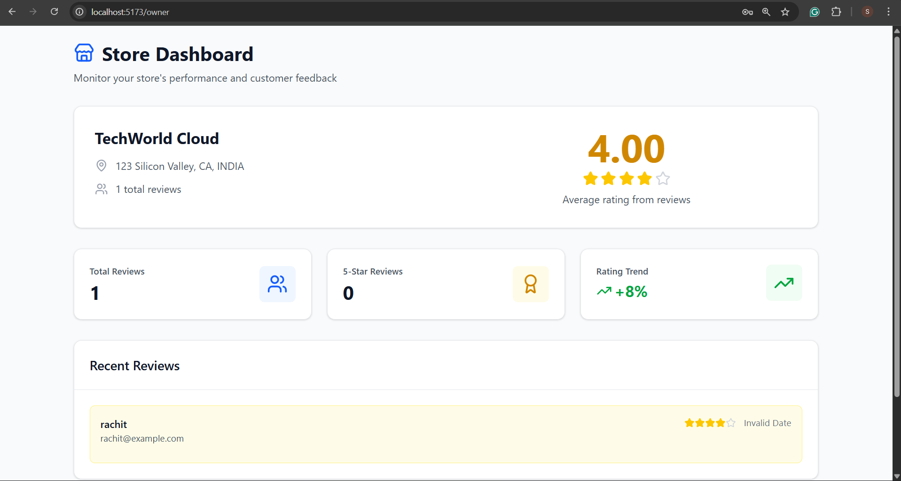
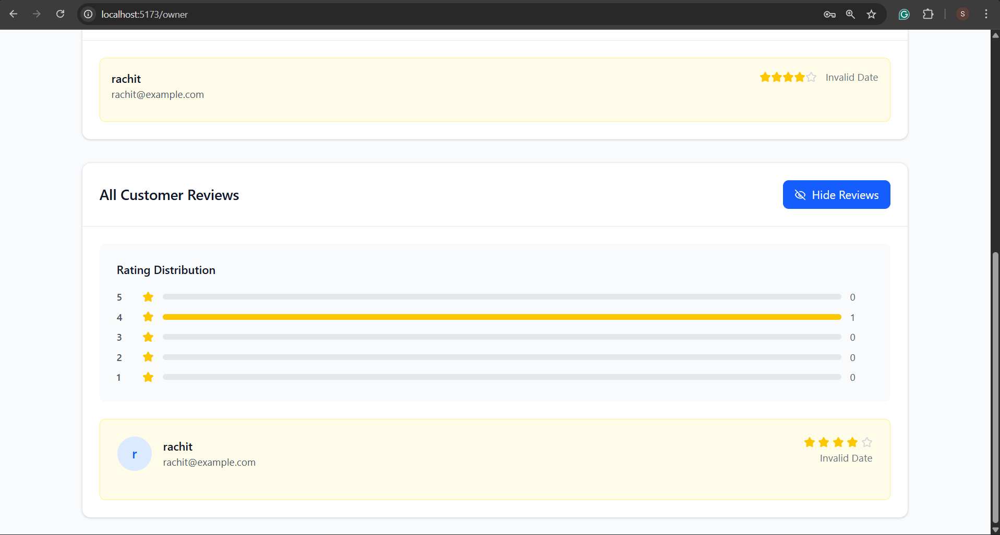

## Run in your local
- docker compose up -d --build
## for profile page
- go to /profile

## IMAGES

docker build -t k8s-rating-app --build-arg VITE_API_URL=http://localhost:5000/api .

<!-- EBS CSI DRIVER -->

1. What is EBS CSI Driver?

The AWS EBS CSI Driver is a Container Storage Interface (CSI) driver that lets your Kubernetes cluster use Amazon Elastic Block Store (EBS) volumes as persistent storage for your pods.

EBS = Block-level storage volumes on AWS.

CSI Driver = A plugin that allows Kubernetes to connect to different storage systems.

So, EBS CSI Driver = a bridge between Kubernetes and EBS.

👉 In simple words:

“It allows pods in your EKS cluster to dynamically create, attach, and use EBS volumes as persistent disks.”

<!-- IAM OICD Provider -->

What is an IAM OIDC Provider?

An IAM OIDC provider (OpenID Connect provider) in Amazon Web Services is a trusted identity provider that allows AWS services (like EKS) to verify identities and issue temporary credentials to workloads.

In simple terms:

OIDC provider = a secure way to let your Kubernetes pods access AWS resources without needing long-term credentials.

✅ OIDC stands for OpenID Connect — it’s an identity layer built on top of OAuth 2.0.

